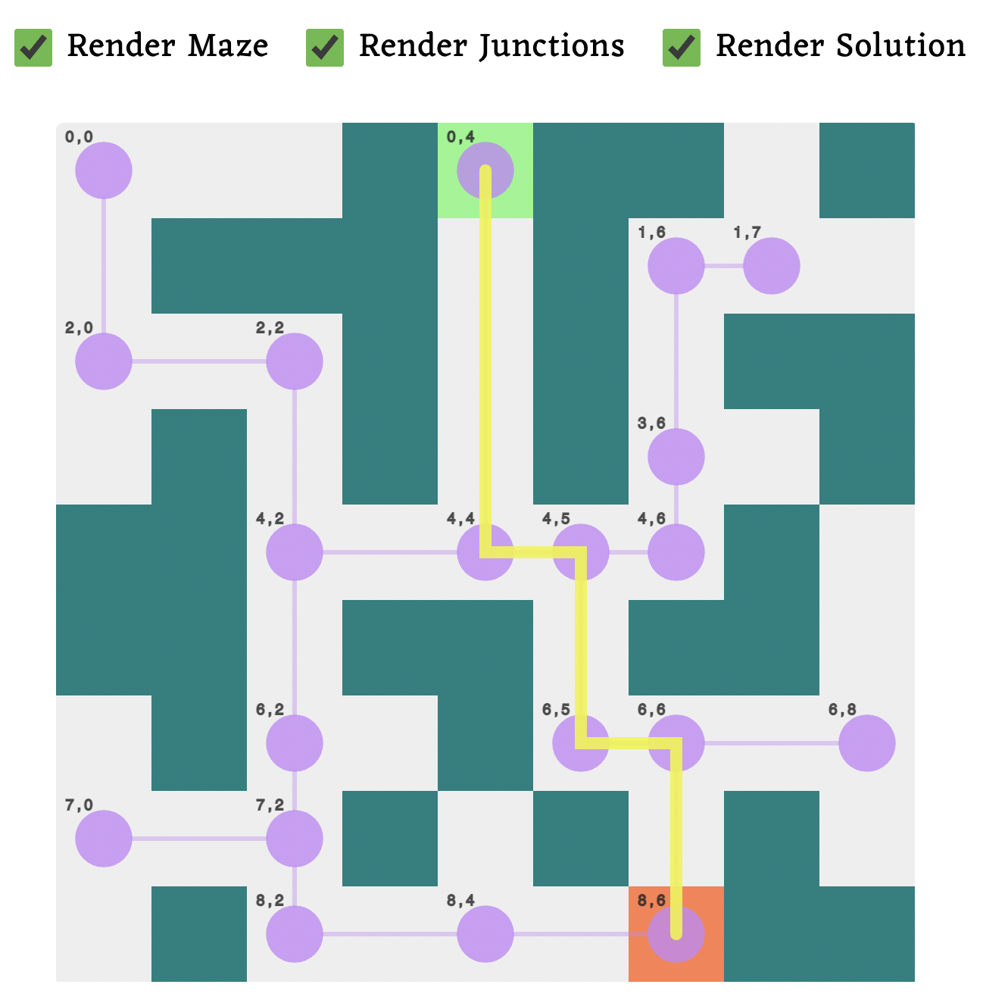
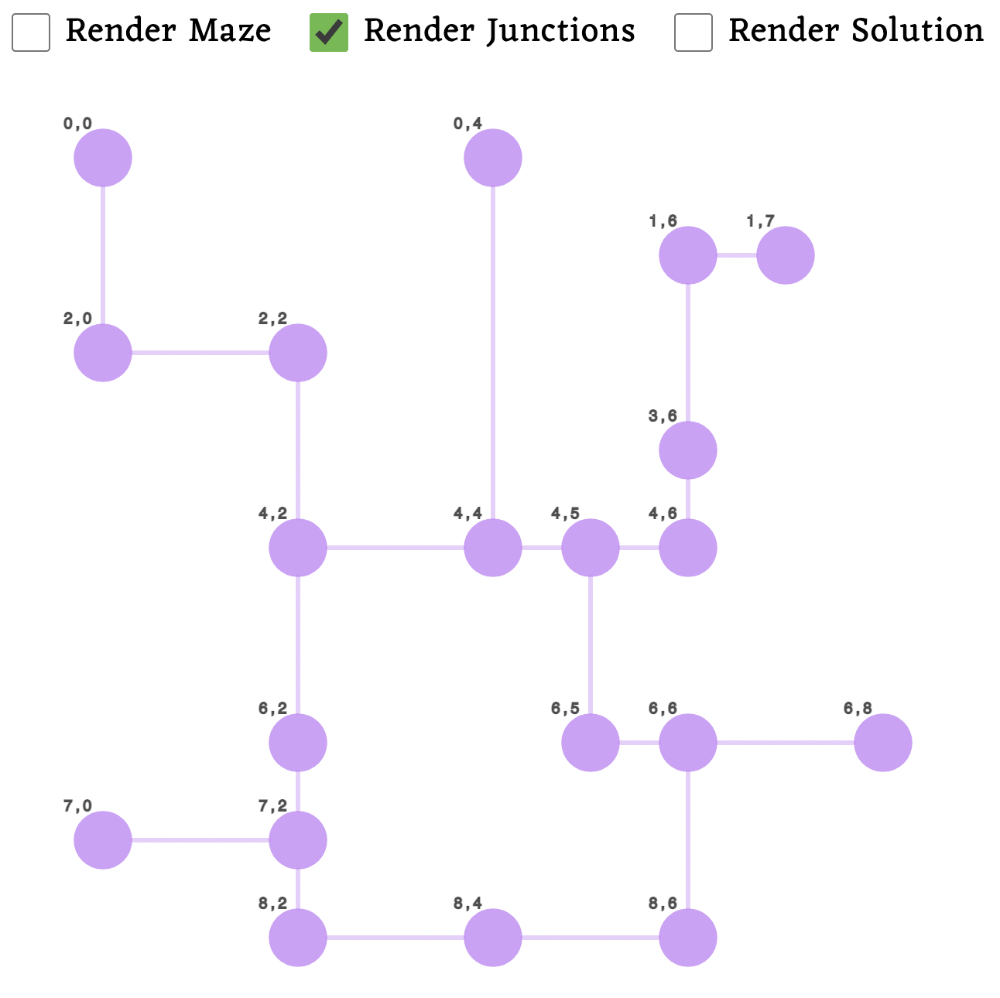

# Solving a maze with Dijkstra's Algorithm

This is a react & typescript website. When given some maze data, it will solve the maze and render the solution in a `<canvas>`. 

__The final thing looks like this:__

The maze is converted into a weighted graph data structure, where the nodes of the graph are the "junction points" / "decision points" of the maze. The app will render little markers on the junction point cells (the circles in the picture above), so you can see the nodes of the graph. If you toggle off rendering of the maze, you can more easily see the graph (the nodes and edges).

Next, Dijkstra's algorithm will find the shortest path to all nodes in the graph, but we're interested in the one to the end cell of the maze.

## Details

- The app makes use of several data structures, which can be found in `/src/classes/DataStructures`
  - Graph (with it's GraphNode, GraphNodeLink)
  - SortedLinkedList (which is used as a priority queue)
  - DijkstrasPathLookupTable (which is what stores the shortest distance and path to each node)
- The maze is first converted to a graph datastructure.
  - That takes place in `/src/solveMaze/makeGraphFromMaze.ts`
- The graph is analyzed with Dijkstra's Algorithm
  - That takes place in `/src/solveDijkstras.ts`
- I put basically all the other logic in `/src/classes/Maze.ts`
- The React stuff is in `/src/components/`, but there isn't much interesting there except maybe the test maze data (the input to the `Maze.ts`)